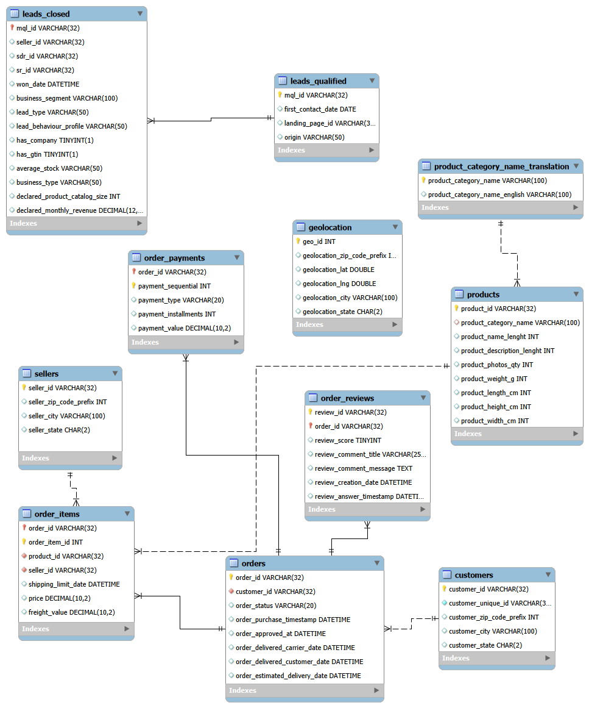
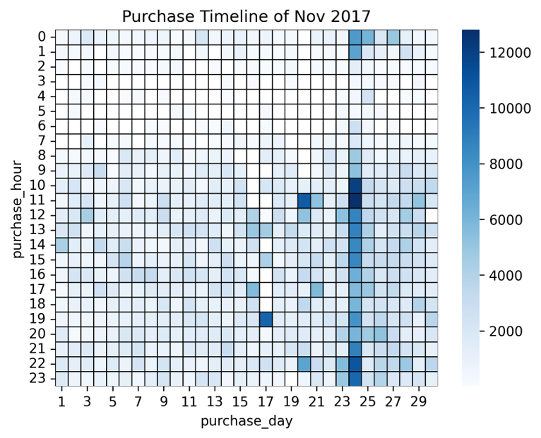
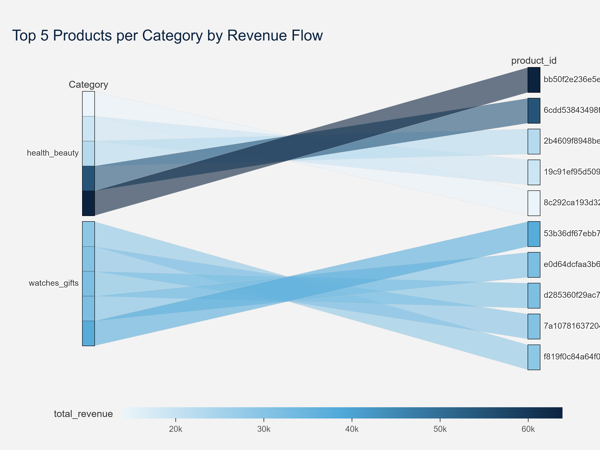
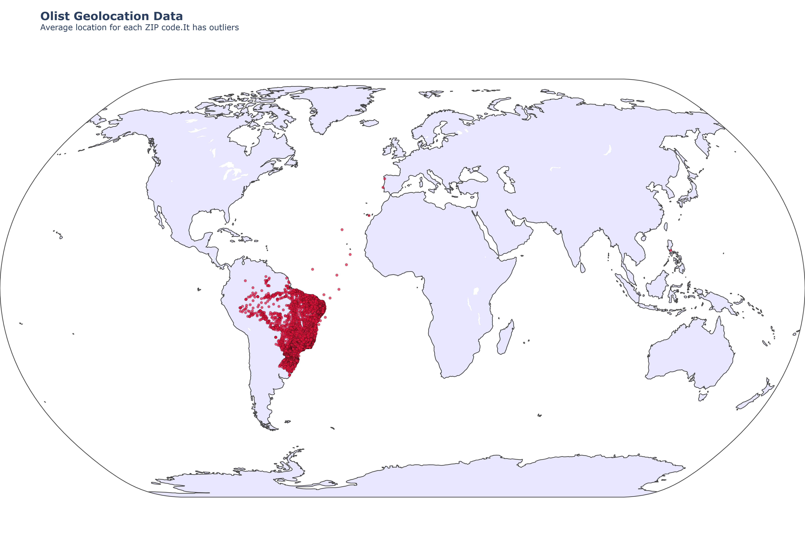
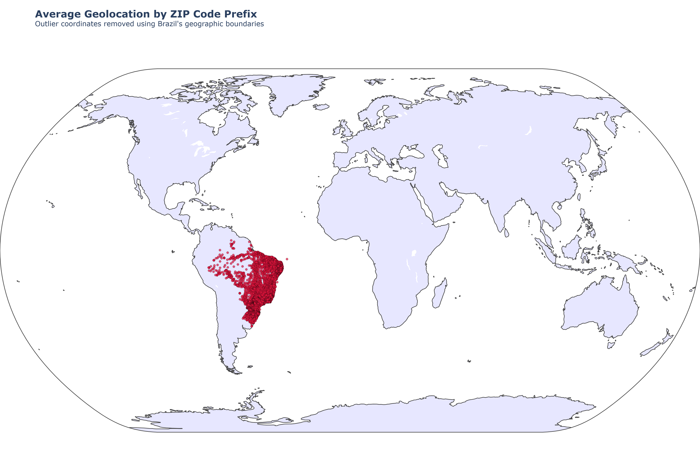
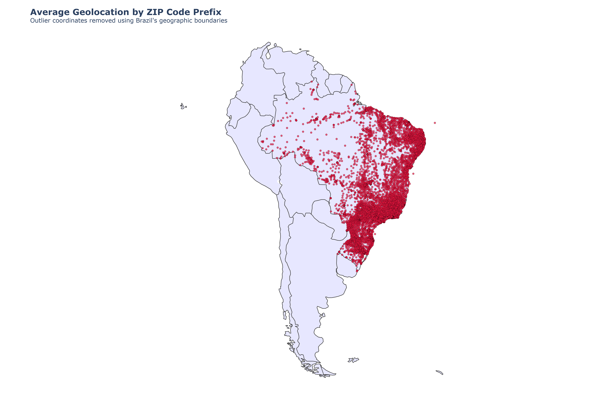
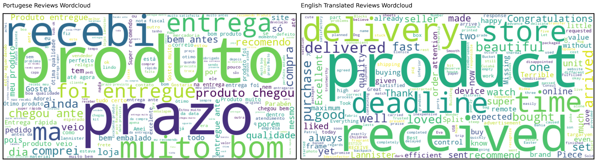

# Brazilian E-Commerce Analytics & Business Optimization (Olist Dataset)

## Project Overview

**Olist** is the largest departmental marketplace in Brazilian e-commerce. This project analyzes **100,000+ transactional orders (2016–2018)** across 11 relational tables to uncover customer purchasing behavior, revenue drivers, regional logistics bottlenecks, and customer satisfaction factors.

### Dataset & Acknowledgments
- **Source:** [Olist Brazilian E-Commerce Dataset on Kaggle](https://www.kaggle.com/datasets/olistbr/brazilian-ecommerce)
- **Description:** Real anonymized commercial data provided by Olist, representing over 100,000 orders placed across multiple marketplaces in Brazil from 2016 to 2018.

### Key Questions Answered
- How are monthly order volumes and total revenue trending?
- What happened during peak sales windows like **Black Friday 2017**?
- Which product categories generate the most revenue under the **80/20 Pareto Rule**?
- Where are customers and sellers concentrated geographically?
- What payment methods do shoppers prefer?
- What operational bottlenecks cause negative 1-star customer reviews?

---

## Tech Stack & Tools

- **Python (Pandas & NumPy):** Data cleaning, timestamp conversion, multi-table joins, and feature engineering.
- **Large Language Models (`agno` & Groq API):** Translating Portuguese customer reviews to English using Pydantic schemas.
- **Microsoft Excel:** Interactive dashboards, dynamic pivot tables, and conditional formatting.
- **Visualization & Text Analytics:** Pivot charts, Pareto curves, and multi-language word clouds (`WordCloud`).

---

## Data Engineering & Relational Architecture

The raw dataset spans **9 CSV tables** connected via primary/foreign keys (`order_id`, `customer_id`, `product_id`, `seller_id`). We built a structured data engineering pipeline to clean, aggregate, and model the data without row duplication.

<div align="center">
  
  <p><em>Figure: Olist Relational Database Schema across all 11 tables.</em></p>
</div>

### Key Data Preparation Steps
1. **Payment Aggregation:** Grouped multi-payment records (`groupby('order_id')`) into exactly one payment row per order.
2. **Review Aggregation:** Combined scores and comment texts into one review record per order.
3. **Category Translation:** Mapped Portuguese category names (`beleza_saude`) to English (`health_beauty`).
4. **Feature Engineering:** Extracted `Purchase Month/Hour`, `Approval Days`, `Shipping Days`, `Delivery Days`, and `Delivery Delay`.
5. **Master Models:** Built **Item Master** (`order_item_id` level) and **Order Master** (`order_id` level).

---

## Business Insights & Visual Analytics

### 1. Revenue & Order Growth Trends

<div align="center">
  
  <p><em>Figure 1: Monthly Revenue Trend (September 2016 – August 2018).</em></p>
</div>

<div align="center">
  
  <p><em>Figure 2: Monthly Order Volume Trajectory.</em></p>
</div>

#### What the Data Tells Us
- **Rapid 2017 Growth:** Order volumes scaled steadily quarter-over-quarter as platform adoption increased.
- **Black Friday Record:** **November 2017** was the peak month in platform history, crossing **R$1,000,000 revenue** and **7,200 orders** during Black Friday.
- **2018 Stability:** Order volume stabilized at a mature plateau of **6,000–7,000 monthly orders** across 2018.

---

### 2. November 2017 Purchase Heatmap

<div align="center">
  
  <p><em>Figure 3: Day-and-Hour Purchase Heatmap for November 2017.</em></p>
</div>

#### What the Data Tells Us
- **Extreme Concentration:** Purchases were intensely concentrated on **November 24th (Black Friday)**.
- **Prime Shopping Hours:** Order volume surged continuously from **10:00 AM to 11:00 PM (`Hour 23`)**.
- **Operational Takeaway:** Server auto-scaling and payment gateway capacity must be doubled during this exact 14-hour window, alongside scheduling extra warehouse shifts on November 25th–27th.

---

### 3. Product Performance & The Pareto 80/20 Rule

<div align="center">
  
  <p><em>Figure 4: Top 10 Product Categories by Revenue.</em></p>
</div>

<div align="center">
  
  <p><em>Figure 5: Products by Revenue.</em></p>
</div>

<div align="center">
  
  <p><em>Figure 6: Pareto Cumulative Contribution Analysis.</em></p>
</div>

#### What the Data Tells Us
- **Top Categories:** **Health & Beauty (`health_beauty`)** ranks #1 (>R$1.2M), followed by **Watches & Gifts** (>R$1.15M) and **Bed, Bath & Table** (>R$1.0M).
- **The 80/20 Rule:** Out of 70+ product categories, **exactly 17 categories generate 80% of total revenue**.
- **Operational Takeaway:** Management should focus marketing budgets, volume shipping discounts, and inventory partnerships on these 17 core categories.

---

### 4. Geographic Supply & Demand

<div align="center">
  
  <p><em>Figure 7: Revenue Contribution by Top 10 States.</em></p>
</div>

<div align="center">
  
  <p><em>Figure 8: Customer vs. Seller Distribution by State.</em></p>
</div>

<div align="center">
  
  
  <p><em>Geographic Plot of Brazilian Coordinates.</em></p>
</div>

<div align="center">
  
  <p><em>South America Regional Geographic Map.</em></p>
</div>

#### What the Data Tells Us
- **São Paulo Dominance:** **SP** dominates the platform with **38% of revenue (`>R$5.0M`)**, **42% of customers**, and **60% of sellers**.
- **Regional Supply Gaps:** States like **Rio de Janeiro (`RJ ~13% customers`)** and **Minas Gerais (`MG`)** have strong customer demand but few local sellers (`RJ ~6% sellers`).
- **Operational Takeaway:** Shipping from SP to RJ/MG creates high freight costs (`freight_value`) and longer delivery times. Opening **regional cross-docking fulfillment hubs** in RJ and MG will drastically lower shipping costs and delivery delays.

---

### 5. Payment Preferences & Installments

<div align="center">
  
  <p><em>Figure 9: Payment Method Distribution.</em></p>
</div>

#### What the Data Tells Us
- **Credit Cards Dominate:** **74.75% of orders** are paid via **Credit Card (`credit_card`)**, heavily leveraging multi-month installment plans (`payment_installments` 3x–10x).
- **The Boleto Opportunity:** **Boleto (`boleto`)** accounts for ~19% of orders but suffers from a ~20%–30% unpaid expiration rate.
- **Operational Takeaway:** Sending automated SMS/WhatsApp reminders 24 hours after a Boleto is issued will recover substantial uncompleted sales.

---

### 6. Delivery Performance & Customer Ratings

<div align="center">
  
  <p><em>Figure 10: Monthly Delivery Performance against Estimated Deadlines.</em></p>
</div>

<div align="center">
  
  <p><em>Figure 11: Review Score Distribution.</em></p>
</div>

#### What the Data Tells Us
- **High SLA Adherence:** On average, **~95% of orders arrive on or before the estimated deadline**.
- **Customer Satisfaction:** **77% of reviews are positive (5★: ~57%, 4★: ~20%)**.
- **Why 1-Star Reviews?** Over **85% of 1-star reviews (`~12%–14% total`)** are caused directly by **delivery delays exceeding 3 days beyond the estimated date** or damaged shipments.

---

## Natural Language Processing & AI Review Translation

Because the customer reviews in `olist_order_reviews_dataset.csv` are in **Portuguese**, we built an automated translation pipeline using **Python, Agno (`Agent`), Groq (`qwen/qwen3-32b`), and Pydantic** to perform clean English text analytics.

### Python Code: Automated Portuguese-to-English Review Translation

```python
import pandas as pd
from agno.agent import Agent
from agno.models.groq import Groq
from pydantic import BaseModel, Field
import time

df = pd.read_csv("/content/olist_order_reviews_dataset.csv")
new_df = df.dropna(subset=["review_comment_message"], how="all")

new_df_1 = new_df.set_index("review_id")["review_comment_message"].to_dict()

class Response(BaseModel):
    english: str = Field(..., description="Give the english translated text")

agent = Agent(
    model=Groq(id="qwen/qwen3-32b", api_key="<API-Key>"),
    instructions="You are Portuguese to English translator.",
    output_schema=Response
)

translated_df = {}
for i, j in list(new_df_1.items())[:500]:
    response = agent.run(j, output_schema=Response)
    translated_df[i] = response.content.english
    time.sleep(3)
```

---

### Customer Review Word Cloud Analysis

<div align="center">
  
  <p><em>Figure 12: Side-by-Side Word Cloud Analysis (Portuguese vs. English Translated).</em></p>
</div>

#### What the Text Analytics Tells Us
- **Portuguese Keywords:** **`produto` (product)**, **`entrega` (delivery)**, **`prazo` (deadline/time)**, and **`recebi` (received)**.
- **English Keywords:** **`product`**, **`delivery`**, **`deadline`**, **`time`**, **`fast`**, and **`quality`**.
- **Key Takeaway:** Customer sentiment revolves almost entirely around **whether packages arrive within the promised deadline (`prazo`/`deadline`) and meet expected quality (`produto`)**.
